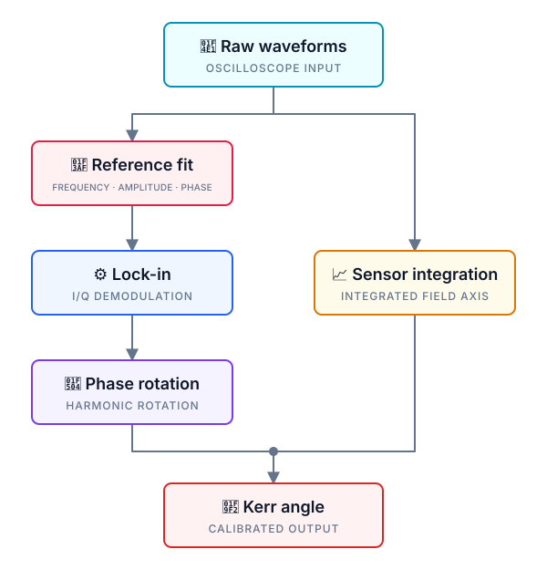

<h1 align="center">💥 pmoke</h1>

<p align="center">
  <strong>Pulsed-field MOKE, from instrument trigger to Kerr angle.</strong>
</p>

<p align="center">
  <code>ACQUIRE</code>&nbsp;&nbsp;·&nbsp;&nbsp;<code>DEMODULATE</code>&nbsp;&nbsp;·&nbsp;&nbsp;<code>ROTATE</code>&nbsp;&nbsp;·&nbsp;&nbsp;<code>ANALYZE</code>
</p>

<p align="center">
  <a href="https://github.com/Kerr-group/pmoke/actions/workflows/ci.yml"></a>
  <a href="https://kerr-group.github.io/pmoke/en/"></a>
  <a href="https://www.rust-lang.org/"></a>
  <a href="LICENSE"></a>
</p>

<p align="center">
  <a href="https://kerr-group.github.io/pmoke/en/">📖 Documentation</a>
  · <a href="#quick-start">⚡ Quick start</a>
  · <a href="#command-surface">⌨️ Commands</a>
  · <a href="https://kerr-group.github.io/pmoke/ja/">🇯🇵 日本語</a>
</p>

---

`pmoke` is a Rust command-line and terminal application for pulsed
magneto-optical Kerr effect measurements. It connects acquisition hardware,
tracks reproducible run artifacts, and executes the numerical analysis chain
used to recover a Kerr signal from large oscilloscope captures.

<p align="center">
  
</p>

## ✨ Why pmoke

| Capability | What it provides |
| --- | --- |
| 📥 Binary acquisition | Rigol DHO5000-series 16-bit WORD captures without a CSV bottleneck |
| 〰️ Numerical lock-in | Boxcar, zero-phase FIR/IIR, phase rotation, and Kerr-angle analysis |
| 🔌 Instrument transports | Direct TCP/IP, Linux GPIB, Windows USBTMC/VISA, and Prologix TCP/serial |
| 🖥️ Live terminal UI | One command surface for configuration, analysis, logs, selection, and monitoring |
| 🧾 Reproducible runs | Versioned TOML configuration, immutable snapshots, checksums, and isolated run directories |
| 🌐 Browser tools | Rust/Wasm configuration validation and interactive waveform analysis in the documentation site |

<a id="quick-start"></a>

## ⚡ Quick start

### 📦 Install

Clone the repository, then use the platform build that matches the host:

```bash
git clone https://github.com/Kerr-group/pmoke.git
cd pmoke

# Linux / Windows: all transports
cargo install --path . --locked

# macOS: direct TCP/IP and Prologix TCP/serial, without direct GPIB
cargo install --path . --locked --no-default-features \
  --features hw-core,hw-prologix-tcp,hw-prologix-serial

# Analysis-only: no hardware transports
cargo install --path . --locked --no-default-features

# Plotting and Python-backed analysis
python -m pip install -r requirements.txt
```

The default Linux/Windows build enables the complete transport surface. Custom
builds can still select a smaller transport set:

- 💥 **Complete Linux / Windows build** · default features
- 🍎 **macOS hardware build** · all transport features except `hw-gpib`
- 💻 **Analysis-only build** · `--no-default-features`
- 🧩 **Custom transport build** · `--no-default-features --features <features>`

See the [feature matrix](https://kerr-group.github.io/pmoke/en/docs/installation/feature-flags/)
for platform notes and combined builds.

### ▶️ Run

```bash
# Generate, validate, and diagnose a configuration
pmoke config init --output config.toml
pmoke --config config.toml config validate
pmoke --config config.toml doctor

# Analyze existing waveforms into an isolated run directory
pmoke --config config.toml --run-dir shot-001 analyze

# Open the terminal workspace; running `pmoke` alone does the same
pmoke --config config.toml monitor
```

Hardware-enabled builds add `single`, `trigger`, `autoshot`, `fetch`,
`screenshot`, `automeasure`, `process`, and `auto`. The complete automated
measurement and analysis path is:

```bash
pmoke --config config.toml --run-dir shot-001 auto
```

<a id="command-surface"></a>

## ⌨️ Command surface

- 🖥️ **Terminal workspace** · `pmoke`, `pmoke monitor`
- ⚙️ **Configuration** · `pmoke config init|validate|explain|migrate`
- 🩺 **Diagnostics** · `pmoke doctor`, `pmoke show`, `pmoke raw verify`
- 🚀 **Full analysis** · `pmoke analyze`
- 🧪 **Analysis stages** · `pmoke reference|sensor|li|phase|kerr`
- 🔌 **Instrument registry and queries** · `pmoke instruments list|explain|query`
- ⏱️ **Transport benchmarks** · `pmoke bench scpi-query|transport`
- 📤 **Data interchange** · `pmoke export csv|npy`

The generated [CLI reference](https://kerr-group.github.io/pmoke/en/docs/cli/reference/)
is the source of truth for flags and feature-gated commands.

## 🧱 Workspace

```text
pmoke/
├── src/                         CLI, TUI, workflows, and Python bridge
├── crates/
│   ├── instruments/             instrument registry and drivers
│   ├── gpib-rs/                 direct GPIB transport
│   ├── prologix-rs/             Prologix TCP and serial transport
│   ├── pmoke-config-core/       shared configuration model and validation
│   ├── pmoke-analysis-core/     shared numerical analysis
│   └── pmoke-web-wasm/          browser bindings for shared Rust cores
├── website/                     bilingual Fumadocs site and browser tools
├── scripts/                     benchmark plotting and comparison utilities
└── xtask/                       generated CLI and configuration references
```

## 📚 Documentation

| Guide | English | 日本語 |
| --- | :---: | :---: |
| Quick start | [Open](https://kerr-group.github.io/pmoke/en/docs/quickstart/) | [開く](https://kerr-group.github.io/pmoke/ja/docs/quickstart/) |
| CLI reference | [Open](https://kerr-group.github.io/pmoke/en/docs/cli/reference/) | [開く](https://kerr-group.github.io/pmoke/ja/docs/cli/reference/) |
| Configuration | [Open](https://kerr-group.github.io/pmoke/en/docs/configuration/reference/) | [開く](https://kerr-group.github.io/pmoke/ja/docs/configuration/reference/) |
| Waveform analyzer | [Open](https://kerr-group.github.io/pmoke/en/docs/interactive/waveform-analyzer/) | [開く](https://kerr-group.github.io/pmoke/ja/docs/interactive/waveform-analyzer/) |
| Citation & references | [Open](https://kerr-group.github.io/pmoke/en/docs/citation/) | [開く](https://kerr-group.github.io/pmoke/ja/docs/citation/) |

## 🔬 Publications

If `pmoke` materially contributes to published work, consider citing the
software version and the measurement method relevant to the experiment. See the
[citation guide](https://kerr-group.github.io/pmoke/en/docs/citation/) for a
version-pinned software citation and selection guidance.

- A. Ikeda, S. Nakamura, S. Yamane, K. Noda, A. Ikeda, and S. Yonezawa,
  “Magneto-optical Kerr-effect measurements under pulsed magnetic fields over
  40 T using a compact sample fixture,” *Physical Review Research* **8**,
  013169 (2026). [doi:10.1103/vy7j-ylb4](https://doi.org/10.1103/vy7j-ylb4)
- S. Yamane, S. Nakamura, A. Ikeda, K. Noda, A. Ikeda, and S. Yonezawa,
  “Magneto-optical Kerr effect measurements under bipolar pulsed magnetic
  fields,” *JJAP Conference Proceedings* **12**, 011011 (2026).
  [doi:10.56646/jjapcp.12.0_011011](https://doi.org/10.56646/jjapcp.12.0_011011)

## 📄 License

Licensed under the [Apache License 2.0](LICENSE).
